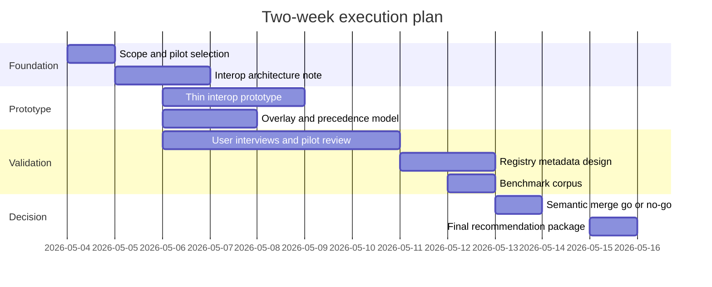
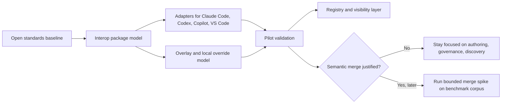

# Research analysis of the attached AI skill sharing brief

## Executive summary

The attached brief is readable and sets a narrowly practical goal: determine whether a small-team “AI skill sharing” product should bet on its own Markdown schema and visibility layer, or instead anchor on existing open standards and focus its effort elsewhere. It asks for explicit extraction of requirements, a rigorous analysis of adjacent spaces, a two-week execution plan, and a draft deliverable in the brief’s requested format. fileciteturn0file0

The highest-confidence conclusion is that the safest strategic path is **interop-first, not syntax-first**. AGENTS.md has moved into Linux Foundation stewardship through the Agentic AI Foundation, Agent Skills is now an explicit open standard maintained by Anthropic and implemented across Claude Code, Codex, GitHub Copilot, and VS Code, and first-party packaging/distribution layers already exist in Claude plugins, Codex skills/plugins, GitHub agent skills, and custom agents. That means a brand-new custom section-ID or markup dialect inside Markdown is more likely to create friction than differentiation. The stronger opportunity is a **cross-vendor authoring, layering, provenance, discovery, and governance layer** that can compile to existing standards and product formats. citeturn11view1turn11view2turn1view6turn29view0turn29view1turn13view3turn16view0

The competitive threat is already real in baseline sync and packaging. Rulesync and AI Rules Sync both position themselves as single-source-of-truth tooling for multi-agent instruction/rules distribution, while Anthropic, OpenAI, GitHub, and Microsoft now expose first-party skills, agents, and marketplaces or catalogs. The public evidence suggests the market is converging on **shared file formats plus vendor-specific packaging**, not on one unified marketplace owner. So the recommended near-term scope is: **build a thin interop model, overlay/override system, metadata/provenance index, and pilot validation loop; defer full semantic merge to a later spike**. citeturn13view0turn13view1turn27view1turn1view7turn16view1turn29view2

The merge/conflict problem is real enough to matter, but the public evidence is stronger for general Git and prompt-management pain than for named, detailed postmortems from teams versioning prompt/rules Markdown at scale. Research and tool activity around semantic merge is substantial, ranging from structure-aware merge systems such as Weave and Mergiraf to LLM-assisted merging and academic work on merge-conflict resolution, but none appears to be a mature, de facto standard for prompt/rule Markdown files specifically. That makes semantic merge a plausible future differentiator, but a weak first two-week bet. citeturn18view2turn18view3turn18view0turn18view1turn19view0turn21view0turn22view0

## What the attached brief explicitly requires

All requirements in the table below are extracted from the attached brief. The status column reflects what this report completes now versus what would still require execution work after this report. fileciteturn0file0

| Requirement area | Explicit requirement from the brief | Status | Notes |
|---|---|---|---|
| Core objective | Research “adjacent / converging / competing” spaces around AI skill sharing for small teams | Completed | This report covers standards, competition, merge tooling, dotfile precedents, and first-party product moves. |
| Time horizon | Focus on “what to do over the next two weeks” | Completed | A two-week action plan and timeline are included below. |
| Research scope | Answer the three clusters of questions labeled A, B, and C | Completed | Each cluster is addressed in the findings section. |
| Output quality bar | “Optimize for signal, not coverage,” and be skeptical | Completed | Recommendations bias toward highest-confidence evidence and call out weak-signal areas explicitly. |
| Decision support | Provide clear recommendations on what should or should not be part of scope | Completed | Scope recommendations are explicit and prioritized. |
| Technical recommendation | Recommend markup/schema direction if a “section markup” idea is still worth pursuing | Completed | Recommendation: avoid inventing a custom in-Markdown section dialect as the core bet. |
| Prototype guidance | Provide a workable prototype strategy | Completed | A thin interop prototype is proposed; semantic merge is framed as a later spike. |
| Market/problem sharpness | Assess how sharp the prose-merge / collaboration problem really is | Completed | Evidence is moderate for the problem, weaker for enterprise postmortems specific to prompt/rules repos. |
| Iteration planning | Provide a rationalized iteration plan for the next few iterations | Completed | Included below as a prioritized timeline and draft deliverable outline. |
| Requested report format | Executive summary, findings by question, proposed revised iteration plan, and reading list | Completed | Included below in both analytical and draft-deliverable form. |
| Evidence preference | Prioritize official sources and original papers where applicable | Completed | Most citations are to official docs, specifications, repositories, and primary research papers. |
| Confidence signaling | Include rough estimates and indicate confidence vs weak signal where helpful | Completed | Confidence is stated in the analysis narrative. |

The brief’s implicit success criteria are not just “research completeness,” but **decision usefulness**: a recommendation on standards strategy, a realistic sequencing plan, and a credible answer to whether the product’s differentiated value lies in portability, visibility/governance, merge automation, or something else. fileciteturn0file0

## Unspecified information and working assumptions

Several important items are **not specified** in the attached brief and materially affect execution quality.

There is **no explicit calendar deadline**, only a relative “next two weeks” framing. This report therefore assumes work starts on **2026-05-04** and runs as a ten-business-day sprint. There is also **no named owner**, no committed engineering capacity, no target user count, no explicit pilot team, no target pricing hypothesis, and no internal corpus of real team rule/skill files to benchmark against. Those omissions matter: they increase uncertainty around the actual severity of merge/versioning pain and around which tool surfaces deserve first-class support beyond Claude Code, Codex, GitHub Copilot, and VS Code. fileciteturn0file0

The report therefore makes four working assumptions. First, the near-term goal is a **research-and-design sprint**, not full productization. Second, the minimum target ecosystem is **AGENTS.md + Agent Skills + Claude Code + Codex + GitHub Copilot/VS Code**, because those surfaces already expose public standards and file/package models. Third, “visibility” means **discoverability, provenance, compatibility, ownership, and adoption signals**, not a public marketplace launch. Fourth, because public evidence on enterprise prompt-rule repos is incomplete, **direct user validation is a required follow-on**, not optional polish. These assumptions are consistent with the attached brief’s emphasis on signal, skepticism, and two-week practicality. fileciteturn0file0

## Research findings and recommendations

### Standards and interop

The existing standards environment argues strongly against making a custom Markdown section dialect the product’s center of gravity. CommonMark and GitHub Flavored Markdown standardize Markdown parsing behavior, but they do not establish a portable, cross-implementation convention for “stable hidden section IDs” carried in comments. HTML comments are treated as comment/HTML blocks, and explicit heading identifiers are largely an **extended Markdown** feature, not a universal core behavior. Pandoc, for example, supports explicit and auto-generated heading identifiers; AGENTS.md, by contrast, intentionally defines no required fields at all. Taken together, that suggests a hidden comment-based ID scheme would be **possible**, but not a strong interoperability foundation. The more durable approach is to preserve plain Markdown for humans and put stable identifiers in **optional frontmatter, sidecar manifests, or tool-level metadata** that can degrade gracefully when ignored. This is an inference from the specs and docs, but it is the safest one. Confidence: **medium-high**. citeturn10view0turn10view1turn10view2turn1view2turn30view1turn30view2

The broader standardization trend is favorable. AGENTS.md is now stewarded by the Agentic AI Foundation under the Linux Foundation, and OpenAI positions it as a portable way to provide project-specific instructions across tools. Agent Skills is an open format maintained by Anthropic and explicitly designed for portability. GitHub Copilot, VS Code, Claude Code, and Codex all now expose public skills or AGENTS-style instruction mechanisms, which is unusually strong cross-vendor alignment for such a young category. At the same time, the standards are still evolving: open AGENTS.md issues include proposals around standardized rule formats, companion task standards, and expansion toward links with skills, hooks, and rules. In practice, that means the space is **standardized enough to build on**, but **not mature enough to overfit**. Recommendation: build around the existing interop core, and keep any extensions optional and thin. Confidence: **high** on standard adoption, **medium** on medium-term spec stability. citeturn11view1turn11view2turn1view6turn29view0turn29view1turn13view3turn16view0turn6search0turn11view0

On competition, there are already multiple approaches to “shared skills/rules across tools.” Rulesync describes itself as unified AI rules management and supports generation for multiple AI development tools from unified rule files. AI Rules Sync positions itself around Git repo-backed synchronization, symlinks, multi-repository composition, and support for Claude, Copilot, Cursor, Codex, Gemini CLI, Warp, and others. Continue provides reusable prompts as shareable, reusable building blocks, though it is more adjacent than directly overlapping. Meanwhile, first-party ecosystems from Anthropic and OpenAI already ship public skills repositories and product-native plugin/skill workflows. This means a product in this space **cannot win on “shared files exist” or “transpile configs” alone**. The defendable layer is more likely to be **governed composition**: overlays, provenance, policy, search/ranking, compatibility intelligence, evaluation, and migration across first-party surfaces. Confidence: **high**. citeturn27view1turn13view0turn13view1turn13view2turn16view1turn16view2turn1view7

On evidence of multi-tool demand, the best public signal is **supply-side convergence**, not definitive public usage numbers. AI Rules Sync explicitly markets multi-tool support and multi-repository mixing. Rulesync emphasizes author-once/generate-everywhere and supports rules, commands, MCP, ignore files, subagents, and skills. GitHub and VS Code now recognize project skills from `.github/skills`, `.claude/skills`, and `.agents/skills`, which is a strong sign that repository owners are expected to support more than a single vendor-specific location. That does not prove how many teams actively share skills across ChatGPT, Claude, Cursor, and Gemini today, but it does show that the market has already moved beyond single-surface assumptions. Confidence: **medium-high** for directional demand, **medium** for quantified demand. citeturn13view0turn13view1turn27view1turn29view0turn29view1

### Collaboration pain and competitive pressure

The case for a collaboration/versioning problem is strong enough to take seriously. Microsoft Research’s merge-conflict paper notes that in large projects nearly 20% of merge attempts can fail, and GitHub’s conflict UI is limited to competing line changes. The prompt-management study argues that GitHub’s file-and-line management model is a poor match for prompts because prompts are unstructured or semi-structured, while prompt quality controls are far less mature than code controls. CoPrompt then adds a collaborative HCI finding: prompt engineering in team settings imposes overhead around awareness of collaborators’ intents and work. The inference is straightforward: long Markdown rule/skill/instruction files are especially exposed to “same file, different reasoning” collisions, even if the public literature does not yet focus specifically on AGENTS/skills repos. Confidence: **medium-high** that the pain is real, **medium** on how acute it is for the exact target user segment. citeturn19view0turn23search3turn21view0turn22view0

Public evidence for named, internal enterprise skill marketplaces is much thinner than public evidence for external or first-party catalogs. Anthropic has an official Claude plugin marketplace and a public skills repository; OpenAI has a public skills catalog for Codex and product docs for skill creation and installation; GitHub exposes `gh skill` and agent-skill workflows; Google Cloud is promoting an external AI Agent Marketplace. What is missing from high-confidence primary sources is a detailed technical case study from a named enterprise describing a mature, internal “skill marketplace” lifecycle with submission, review, scoring, versioning, and sunset mechanics. That does not mean such systems do not exist; it means the public, primary-source record is sparse enough that product claims here should be validated through interviews rather than assumed. Confidence: **high** on external/catalog-market evidence, **low-to-medium** on internal-market maturity evidence. citeturn1view7turn16view2turn16view1turn29view0turn14search5

The first-party undercut risk is real and immediate. Anthropic’s plugin system packages skills, agents, hooks, MCP servers, LSP servers, and monitors; it also supports marketplaces and semver-constrained plugin dependencies. Codex ships skills, plugin distribution, and built-in skill creation. GitHub Copilot now supports AGENTS.md, agent skills, and custom agents, while VS Code documents agent skills as an open standard that works across Copilot surfaces and can even be generated from AI. In other words, the baseline feature set that might once have been “startup wedge material” is being absorbed into platform surfaces. The implication is not “do not build,” but “do not build the same thing.” The product should not position itself as a replacement for first-party skills/plugins/agents. It should position itself as the **cross-surface layer that those products do not coordinate for the user**. Confidence: **high**. citeturn3view0turn3view1turn13view3turn13view4turn29view0turn29view1turn29view2

### Merge strategies and reusable package design

There is already meaningful prior art beyond line-based merge, which is encouraging but also raises the bar. Weave replaces line-based merging with entity-level merging and explicitly targets independent edits by multiple agents; its docs also describe a CRDT-backed advisory coordination layer and list Markdown among supported languages in secondary materials surfaced through search. Mergiraf uses syntax/tree-aware strategies while falling back to regular line merge when that is sufficient. Separate projects such as sem-merge and llmmerge use AI/LLM assistance for documentation or code merges, while research literature explores LLM-based conflict resolution, test-based semantic conflict detection, and auxiliary clue-generation for merges. The conclusion is that “non-text merge” is no longer speculative. But the evidence does **not** show a mature, widely adopted merge approach specialized for prompt/rule Markdown as a category. Recommendation: do not make a full semantic-merge engine the first two-week scope. Instead, define a benchmark corpus and do a focused spike later. Confidence: **high** that prior art exists, **medium** that the exact prompt/rules merge niche is ripe enough for a first bet. citeturn18view2turn18view4turn18view3turn18view0turn18view1turn19view0turn19view1turn19view2turn19view3

The strongest structural precedent may actually come from dotfile managers. Chezmoi separates source state, target state, templates, runtime data, and custom merge commands; yadm supports alternate files by host, OS, class, and templating, plus hooks and encryption. Those patterns map unusually well onto AI rule/skill distribution: team defaults versus local overrides, environment-specific variants, private non-committed settings, and explicit precedence. This suggests the product should borrow from **dotfile layering and state management**, not just from AI-agent marketplaces. Recommendation: adopt overlays, local/private overrides, environment scoping, and explicit precedence rules early. Confidence: **high**. citeturn26view0turn26view1turn26view2turn26view3

On practitioner evidence, the public record is mixed. The strongest non-academic public material found here is vendor-authored guidance such as RuleSync’s write-up on merging team rulesets, which is directionally useful but not the same as an independent postmortem. The academic side is clearer: collaborative prompting introduces communication and awareness costs, prompt management in GitHub repos is inconsistent and under-supported, and prompt development remains largely ad hoc. The practical recommendation is to treat “recent practitioner retrospectives” as a **weak-signal area** and compensate with direct interviews during the first sprint. Confidence: **medium-low**. citeturn27view0turn21view0turn22view0turn21view1

Public skill sharing is already happening. Anthropic’s public skills repository includes example, enterprise, and document skills, some of which Anthropic states power production Claude document capabilities. OpenAI’s public skills catalog is for Codex distribution and installation. Microsoft hosts a public skills repository spanning skills, MCP servers, custom agents, and AGENTS templates, while GitHub and VS Code document cross-surface agent-skill portability. This is important strategically: “publicly shareable skills” are not a novel category anymore. The novelty must come from **how skills are organized, composed, evaluated, governed, and ported**, not from the mere existence of skill folders. Confidence: **high**. citeturn16view2turn16view1turn28search3turn29view0turn29view1

The package unit question is one of the clearest answers in the research. Agent Skills defines the unit as a **directory** with `SKILL.md` and optional `scripts/`, `references/`, and `assets/` folders, along with progressive disclosure so metadata loads first, then instructions, then resources on demand. Claude plugins go further and bundle skills, agents, hooks, MCP servers, LSP servers, monitors, and dependencies. Codex similarly treats skills as folders and points users toward plugins when they want broader distribution or bundled integrations. Taken together, the market is converging not on “an MCP server is the package,” but on **a capability bundle is the package, and MCP may be one component or dependency inside it**. Recommendation: model packages as capability bundles with optional integrations, not MCP-first units. Confidence: **high**. citeturn30view1turn30view2turn30view0turn3view0turn30view3turn13view3turn16view1turn30view4

## Recommended scope and prioritized action plan

The research points to a clear sequencing rule. **In scope now** should be: standards alignment, package metadata, overlays/precedence, import/export/transpilation, provenance/compatibility metadata, lightweight search/visibility, and direct user validation. **Out of scope for the first two-week sprint** should be: a fully custom Markdown section-ID syntax, a full semantic merge engine, and a public marketplace launch. That is the lowest-risk way to align with the current standards landscape while still creating defensible product surface area. citeturn11view1turn1view6turn29view0turn29view1turn26view0turn26view1

| Priority | Task | Estimated duration | Dependencies | Suggested timeline | Primary output |
|---|---|---:|---|---|---|
| P0 | Confirm target surfaces, pilot users, and evaluation questions | 0.5 day | None | 2026-05-04 | Decision memo on supported tools, user segment, and pilot scope |
| P0 | Write an interop architecture note based on AGENTS.md + Agent Skills + vendor adapters | 1.5 days | Pilot scope confirmed | 2026-05-04 to 2026-05-05 | Schema/adapter decision record |
| P0 | Build a thin prototype that round-trips one skill/package into Claude Code, Codex, and Copilot/VS Code-compatible layouts | 2.5 days | Interop architecture | 2026-05-06 to 2026-05-08 | Working repository prototype |
| P0 | Define overlay/override precedence, including team, project, and local/private layers | 1.5 days | Interop architecture | 2026-05-06 to 2026-05-07 | Precedence model and test cases |
| P0 | Run user validation with 5–8 practitioners or 2 pilot teams using existing rule/skill repos | 3 days | Pilot scope | 2026-05-06 to 2026-05-12 | Interview notes, pain ranking, adoption blockers |
| P1 | Create a lightweight registry index: metadata, ownership, compatibility, last-reviewed date, trust/provenance | 1.5 days | Thin prototype | 2026-05-11 to 2026-05-12 | Searchable catalog schema |
| P1 | Assemble an evaluation corpus of real or synthetic conflicting Markdown rule/skill edits | 1 day | Thin prototype, overlay model | 2026-05-12 | Benchmark seed set |
| P1 | Produce a go/no-go recommendation on semantic merge as the next spike | 0.5 day | Evaluation corpus, user validation | 2026-05-13 | Scope decision note |
| P2 | If time remains, run a narrowly scoped merge spike using heading/block-aware or LLM-assisted merge on the corpus | 1.5 days | Evaluation corpus | 2026-05-13 to 2026-05-14 | Evidence memo, not production code |
| P0 | Final synthesis and executive recommendation | 1 day | All prior tasks | 2026-05-15 | Stakeholder-ready report and iteration plan |

The recommended iteration plan after the first sprint is also straightforward. **Iteration one** should establish the interop core and prove the package model. **Iteration two** should add discoverability, provenance, and governance. **Iteration three** should add richer import/migration and, only if validated, conflict-aware differencing or merge assistance. That sequence follows both the market evidence and the standards trajectory. citeturn29view1turn29view0turn3view0turn26view0turn26view1

## Draft deliverable in the brief’s requested format

### Executive summary

The research suggests the product should **not** lead with a proprietary Markdown section schema. The ecosystem is already converging around AGENTS.md for instructions and Agent Skills for reusable capability bundles, with working implementations in Claude Code, Codex, GitHub Copilot, and VS Code. The better strategic wedge is a cross-vendor layer for **authoring, overlays, provenance, compatibility, visibility, and evaluation**. citeturn11view1turn11view2turn1view6turn29view0turn29view1turn13view3

The merge/versioning problem is real enough to matter, but the public evidence is stronger for general prompt-management friction than for detailed enterprise postmortems specific to skill/rule Markdown files. Semantic merge is worth keeping on the roadmap, but not as the first two-week bet. The near-term product should validate whether users primarily need **portability and governance** or **automated conflict handling**. The evidence here favors the former as the first product slice. citeturn21view0turn22view0turn18view2turn18view3turn19view0

### Findings by question

**On standards.** There is no strong cross-renderer standard for hidden Markdown section IDs, and inventing one would add fragility. Build on AGENTS.md and Agent Skills instead, using optional frontmatter or sidecar metadata where stable identifiers are needed. citeturn10view0turn10view1turn10view2turn30view1turn30view2

**On competition.** Rulesync and AI Rules Sync already attack multi-tool synchronization, while Anthropic, OpenAI, GitHub, and Microsoft now ship first-party skills, agents, or plugin ecosystems. The white space is therefore not “shared skills exist,” but “shared skills are portable, governed, searchable, trusted, and easy to adapt across surfaces.” citeturn27view1turn13view1turn1view7turn16view1turn29view0turn29view1

**On merge pain.** Git and GitHub remain line-oriented, prompt management in GitHub repos is structurally awkward, and collaborative prompting introduces real comprehension and handoff costs. But public evidence for prompt/rules-specific, production-grade retrospectives is still limited, so user interviews should be treated as a required validation step. citeturn19view0turn23search3turn21view0turn22view0

**On package design.** The natural unit is a capability bundle: `SKILL.md` plus optional scripts, references, assets, and, in vendor ecosystems such as Claude plugins, optional agents, hooks, and MCP/LSP components. Design the data model accordingly. citeturn30view1turn30view2turn30view0turn3view0turn13view3

### Proposed revised iteration plan

The clearest revised plan is to spend the next sprint on an **interop baseline** rather than a heavyweight invention. That means defining a canonical internal package model aligned with Agent Skills, compiling it to major target surfaces, testing overlay/override behavior, and validating the resulting workflow with a small number of real users or pilot teams. If that lands well, the next iteration should add a catalog or visibility layer with provenance, ownership, compatibility, and freshness metadata. Only after those pieces are proven should semantic merge graduate from research topic to implementation candidate. citeturn29view1turn29view0turn26view0turn26view1

### Reading list

The core reading list should begin with the public standards and product docs: AGENTS.md, Agent Skills specification, Claude Code plugin and skill docs, Codex skills and AGENTS docs, GitHub Copilot agent skills and custom instructions docs, and the VS Code Agent Skills guide. After that, the most relevant papers are the prompt-management study on GitHub repositories, CoPrompt, the promptware-engineering roadmap, and merge-related work such as the Microsoft Research paper on LLM-based merge conflict resolution and Peritext. Those sources provide the highest signal for standards, product fit, and future merge-roadmap decisions. citeturn1view2turn30view1turn3view0turn16view0turn13view3turn13view4turn29view0turn29view1turn21view0turn22view0turn21view1turn19view0turn19view3

## Open questions and limitations

The biggest limitation in the current evidence base is not standards or first-party tooling; those are well documented. The uncertainty sits elsewhere.

- Public, primary-source evidence for **internal enterprise skill marketplaces** is sparse compared with external catalogs and first-party ecosystems.
- Public evidence for **prompt/rules-specific merge pain** is directional but still indirect; it should be validated with real repositories and interviews.
- This report does **not** include a hands-on prototype evaluation or benchmark run, so the merge recommendations are sequencing guidance, not empirical product proof.
- The attached brief does not specify a pilot team, internal corpus, or exact success metric, so the action plan necessarily includes assumptions. fileciteturn0file0

## Sources and priority

| Priority | Source | Type | Why it matters | Link |
|---|---|---|---|---|
| High | Attached research brief | User-provided | Defines the task, constraints, and delivery format | fileciteturn0file0 |
| High | AGENTS.md site | Official standard site | Confirms AGENTS.md purpose, no required fields, Linux Foundation stewardship | citeturn1view2 |
| High | Linux Foundation AAIF announcement | Official foundation announcement | Establishes AGENTS.md governance and ecosystem context | citeturn11view1 |
| High | OpenAI AAIF announcement | Official vendor announcement | Shows OpenAI’s positioning for AGENTS.md and ecosystem adoption claims | citeturn11view2 |
| High | Agent Skills specification | Official standard/spec | Defines package structure, metadata, progressive disclosure, and resources | citeturn30view1turn30view2turn30view0 |
| High | Claude Code plugins reference | Official product docs | Defines plugin package model and component scope | citeturn3view0turn30view3 |
| High | Claude Code skills docs | Official product docs | Shows Claude’s skill model, standard alignment, and extension points | citeturn16view0turn30view4 |
| High | Codex skills docs | Official product docs | Defines Codex skill packaging, locations, and distribution model | citeturn13view3turn16view1 |
| High | Codex AGENTS.md docs | Official product docs | Shows AGENTS precedence and repository-local instruction loading | citeturn13view4 |
| High | GitHub Copilot AGENTS/custom instructions docs | Official product docs | Confirms AGENTS.md use and multi-location behavior in Copilot CLI | citeturn13view5 |
| High | GitHub agent skills docs | Official product docs | Confirms cross-surface skill portability and `gh skill` workflow | citeturn29view0 |
| High | VS Code Agent Skills guide | Official product docs | Documents open-standard skill behavior and skill generation in VS Code | citeturn29view1 |
| High | Rulesync docs and repo | Official project docs/repo | Leading adjacent competitor for unified AI rules management | citeturn1view4turn27view1 |
| High | AI Rules Sync docs and repo | Official project docs/repo | Leading adjacent competitor for multi-repo, multi-tool rule sharing | citeturn13view0turn13view1 |
| Medium | Prompt-management study on GitHub repositories | Original research paper | Best evidence on prompt asset management limitations in Git/GitHub | citeturn21view0 |
| Medium | CoPrompt | Original research paper | Best evidence on collaborative prompt engineering overhead | citeturn22view0 |
| Medium | Promptware Engineering | Original research paper | Provides roadmap framing for prompt lifecycle and engineering discipline | citeturn21view1 |
| Medium | Microsoft Research merge-conflict paper | Original research paper | Strong evidence on merge pain and LLM-based resolution | citeturn19view0 |
| Medium | Weave | Official repo/docs | Strong prior art for structure-aware and agent-aware merge workflows | citeturn18view2turn18view4 |
| Medium | Mergiraf | Official docs | Prior art for structure-aware merge strategy with fallback behavior | citeturn18view3 |
| Medium | Peritext | Original research paper | Best conceptual precedent for intent-preserving rich-text collaboration | citeturn19view3 |
| Medium | chezmoi docs | Official docs | Strong precedent for templates, state separation, and custom merge tools | citeturn26view0turn26view3 |
| Medium | yadm docs | Official docs | Strong precedent for alternates, local class overrides, and templated variants | citeturn26view1turn26view2 |